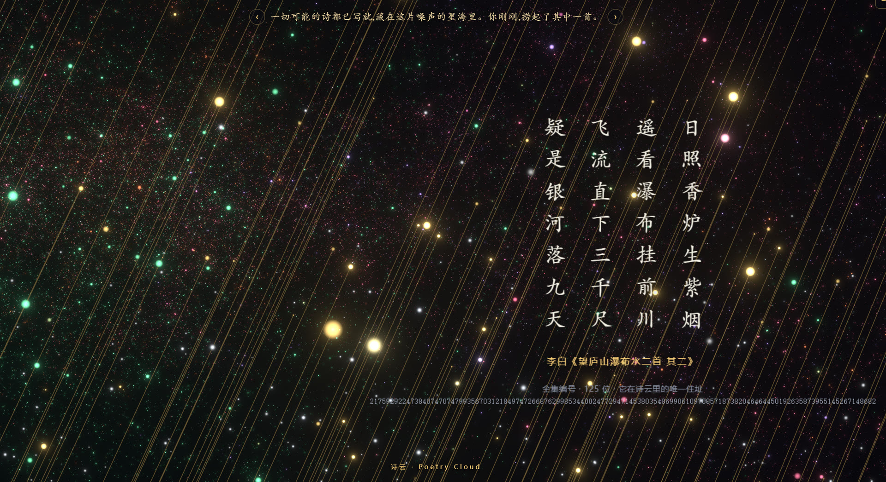
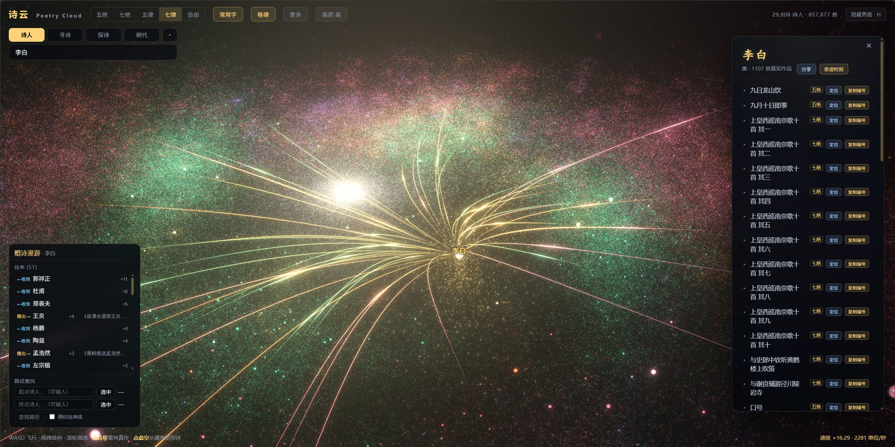
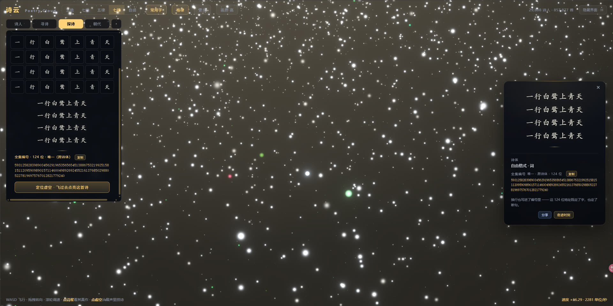
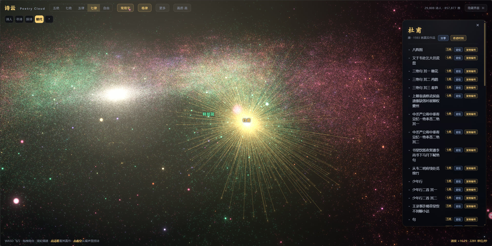

<div align="center">


# 诗云 · Poetry Cloud

[中文](README.md) · **English**

### Three thousand years of Chinese poetry, placed into a roamable 3D galaxy.<br/>Every poet is a star, every poem has its own coordinate — and the void between stars is *every possible poem*.

*Inspired by Liu Cixin's «Poetry Cloud» and Borges' «Library of Babel»: poems aren't stored — give a number and it computes which poem it is, and vice versa.*

[](LICENSE)
[](https://threejs.org)
[](https://react.dev)
[](https://www.typescriptlang.org)
[](#-quick-start)
[](https://github.com/Cohenjikan/shiyun/stargazers)

<br/>

[](https://shiyun.cohenjikan.com)


<sub>▶ Intro video: <a href="docs/assets/promo.mp4">docs/assets/promo.mp4</a>　·　<a href="https://b23.tv/5lPqfvm">Bilibili</a>　·　<a href="https://v.douyin.com/ZOGhSElhG-4/">Douyin</a>　·　<a href="http://xhslink.com/o/5FNxYo4EDPh">Xiaohongshu</a></sub>

</div>

---

## What is this

**32,657 poets and 933,857 poems** — all of Chinese poetry through history, placed into a 3D galaxy. The name and idea come from Liu Cixin's short story «Poetry Cloud» (诗云), about a super-civilization that tries to *write every possible poem by brute force*. I borrowed its name for this one.

Each poet is a star; every poem has its own spatial coordinate. You can zoom and fly through the whole sky, click any star to read a poem, and trace the network of who dedicated poems to whom. From the *Book of Songs* to the modern era — three thousand years of poetry in one universe. **Li Bai is a very bright star, but most of it is people you've never heard of, each holding their own coordinate.**

And the **void** between stars holds something bigger still — it is *every possible regulated-verse poem*. Click empty space and a poem is `unrank`ed out of the noise, shown with its **82–229-digit** address in the "complete catalog" — an address nearly as long as the poem itself (the catalog *is* the library). Poems aren't stored; give a number and it computes which poem it is, and vice versa — masterpieces are just measure-zero bright spots in a sea of noise.

> 🖥 **The desktop experience is the most complete.** Mobile works (touch roaming + adaptive quality), but flying, picking and the relationship graph feel best with a big screen and a mouse.

<div align="center">

### ▶ [Open shiyun.cohenjikan.com and pull a poem out of the star-sea](https://shiyun.cohenjikan.com)

</div>

---

## Screenshots

<table>
<tr>
<td width="50%"><br/><sub><b>Click any star — and there's a poem</b>, together with its long unique address in the "complete catalog".</sub></td>
<td width="50%"><br/><sub><b>Dedication network</b> — poem titles + courtesy-name aliases parsed into 4,849 poet-to-poet arcs; select one to draw their ego-net.</sub></td>
</tr>
<tr>
<td width="50%"><br/><sub><b>Explore</b> — fill in characters and watch the number compute, or reverse a long number back to the one poem it encodes.</sub></td>
<td width="50%"><br/><sub><b>Each poet is a little star-system</b> — more poems, bigger system; one click flies you to any single poem.</sub></td>
</tr>
</table>

---

## What it can do

| Feature | Notes |
|---|---|
| **All dynasties + modern verse** | 先秦 (pre-Qin) → present, 15 concentric dynasty shells, filterable; includes **modern free verse** (徐志摩's «再别康桥», 海子, 北岛, 顾城, 戴望舒…; free forms folded into "other"). |
| **Five forms** | 5/7-char quatrains & regulated verse, plus **free-form / 词** (variable line lengths — the line breaks are part of the number too); a **格律 toggle** roams only the tonally-valid sub-catalog. |
| **Search by any line** | Type *any* line (not just openings) → which real poet it belongs to (疑是地上霜 → 李白's «静夜思», a non-first line still resolves), plus the **half-number** that line pins in the random catalog. |
| **Reverse lookup by number** | `unrank` a long number back to its poem, check the line index and full text, and find out whether that number maps to a *real* poem — the catalog↔poem loop, full untruncated numbers, one-click copy. |
| **Dedication network** | Titles (寄/赠/和/次韵…) plus ~250 courtesy-name aliases (少陵→杜甫, 子瞻→苏轼, 香山→白居易…) parsed into **4,849** arcs, bundled toward the galactic core with a soft pulse flowing giver→receiver. |
| **Shareable permalinks** | `#a=<poetId>` / `#p=<form>.<number>`; a 🔗 button on every poem and poet panel rebuilds the poem and restores the view on load. |
| **Fully static** | All index math + rendering run client-side; the server only serves files — **no backend, ever** (the one optional backend is anonymous feedback collection). |

**Three pull modes to feel it:** pure random「牛蝛茙漂綵」→ tonal「趰㵎憣烔岆」→ tonal + common-chars「思伦要锁馆」; plus free-form 词-like variable lines, and "search by line" to find a real poem from one line.

---

## The idea behind it

Poetry Cloud doesn't store poems — it stores a **bijection**. Every regulated-verse poem corresponds to one huge integer; a number reconstructs the exact poem, and a poem computes back to its number (base-N "Babel" radix + mixed-radix-product rank/unrank for tonal forms, scattered through space by a reversible BigInt Feistel permutation). The index engine is **pure TypeScript with zero dependencies**, fully round-trip reversible, unit-tested green.

So "writing every possible poem" isn't a collection — it's a **computation**: every coordinate in the star-sea is a poem, almost all of it noise, and once in a while one happens to be Li Bai. The real poems by real poets are the named, lit-up points within that sea of noise.

More in [docs/ARCHITECTURE.md](docs/ARCHITECTURE.md) (layers), [docs/ENGINE_API.md](docs/ENGINE_API.md) (engine surface & invariants), [docs/DATA_CONTRACT.md](docs/DATA_CONTRACT.md) (data contract).

---

## 🚀 Quick start

```bash
npm install
npm run dev      # dev preview (Vite)
npm test         # engine round-trip + data-loading unit tests
npm run build    # typecheck + static build → dist/
```

> Node 20+. Stack: **Vite + React 18 + TypeScript + three.js / @react-three (fiber · drei · postprocessing) + zustand**.

The repo ships the lightweight data (galaxy, author search, tonal rules, half-numbers and the dedication network all work out of the box); the **full per-poem text** and the **line-search index** are large derived datasets (git-ignored) — regenerate them from open corpora per [docs/PIPELINE.md](docs/PIPELINE.md) when needed. Full static-hosting guide in **[docs/DEPLOY.md](docs/DEPLOY.md)** (note: `poems/*.json` must be served RAW — the HTTP Range slicing depends on it).

---

## Docs

| Doc | Contents |
|---|---|
| [docs/ARCHITECTURE.md](docs/ARCHITECTURE.md) | Layers, what's stable vs. a replaceable frontend prototype, data flow. |
| [docs/ENGINE_API.md](docs/ENGINE_API.md) | Engine + engineApi surface, invariants, most-significant-digit convention. |
| [docs/DATA_CONTRACT.md](docs/DATA_CONTRACT.md) | Static-asset schemas, corpus sources, dynasty taxonomy. |
| [docs/DATA_AUDIT.md](docs/DATA_AUDIT.md) | Corpus audit: why this set of open corpora. |
| [docs/PIPELINE.md](docs/PIPELINE.md) | How the data + tonal lexicon are built. |
| [docs/FRONTEND_GUIDE.md](docs/FRONTEND_GUIDE.md) | Rebuild contract: the 4 stable interfaces, interaction model. |
| [docs/DEPLOY.md](docs/DEPLOY.md) | Static deploy (nginx + compression + the poems/ Range gotcha). |
| [docs/DEVLOG.md](docs/DEVLOG.md) · [docs/devlog/](docs/devlog/) | Development diary (the iteration chronicle) + archived handoffs / per-change runbooks. |

---

## About

Poetry Cloud is a **vibecoding** project: I ([Cohen](https://cohenjikan.com)) designed and steered the direction, while the main code skeleton and iteration were written by **Claude** — the repo keeps the full human-AI development diary intact ([docs/DEVLOG.md](docs/DEVLOG.md) and [docs/devlog/](docs/devlog/)).

It has earned **~600,000 likes** across Douyin / Xiaohongshu / Bilibili, and is one of a series of my **non-commercial, open-source** projects. The code is MIT — learn from it, self-host it, remix it. Only the poem corpora (especially modern/contemporary texts) remain the copyright of their authors; please don't use them commercially.

More projects at **[cohenjikan.com](https://cohenjikan.com)** and GitHub **[@Cohenjikan](https://github.com/Cohenjikan)**.

---

## Acknowledgements

**Built on the shoulders of these open-source works:**

- **Rendering / framework** — [three.js](https://threejs.org), [@react-three/fiber · drei · postprocessing](https://github.com/pmndrs/react-three-fiber), [React](https://react.dev), [Vite](https://vitejs.dev), [zustand](https://github.com/pmndrs/zustand); the tonal lexicon build uses [opencc-js](https://github.com/nk2028/opencc-js) and [pinyin-pro](https://github.com/zh-lx/pinyin-pro).
- **Poetry corpora** — [Werneror/Poetry](https://github.com/Werneror/Poetry) (MIT, pre-Qin → present, Simplified) as the backbone, layered with [sheepzh/poetry](https://github.com/sheepzh/poetry) and [yuxqiu/modern-poetry](https://github.com/yuxqiu/modern-poetry) (Apache-2.0) for modern verse; tonal rules from [charlesix59's 平水韵](https://github.com/charlesix59/chinese_word_rhyme) (MIT). Each corpus keeps its upstream license — see [docs/DATA_CONTRACT.md](docs/DATA_CONTRACT.md) and [docs/DATA_AUDIT.md](docs/DATA_AUDIT.md).
- **Inspiration** — Liu Cixin's «Poetry Cloud», Borges' «Library of Babel».
- **Development** — the main code skeleton was written by **Anthropic's Claude** (vibecoding).

---

## License

The code is **[MIT](LICENSE)**. The poem corpora keep their own upstream licenses and rights; in particular, modern/contemporary poem **texts** remain the copyright of their original authors and are used here **non-commercially**. See [LICENSE](LICENSE) and the credits note in [docs/DATA_CONTRACT.md](docs/DATA_CONTRACT.md).

<div align="center">
<sub>From the Book of Songs to the modern era — three thousand years of poetry in one universe.</sub>
</div>
